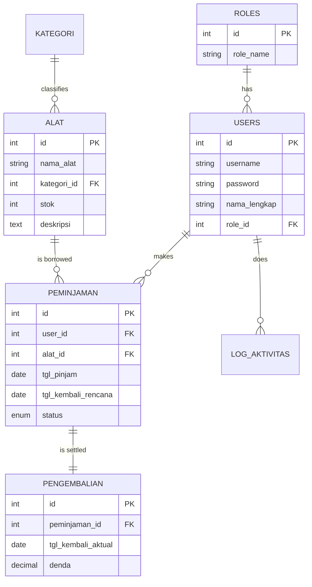

# Entity Relationship Diagram (ERD)

Berikut adalah gambaran relasi antar tabel dalam aplikasi:



# Flowchart Sistem

## 1. Alur Peminjaman
1. User (Peminjam) memilih alat.
2. Sistem mengecek stok via Stored Procedure.
3. Jika stok > 0, data tersimpan dengan status `pending`.
4. Admin/Petugas melihat daftar pengajuan.
5. Admin/Petugas klik "Setujui".
6. Trigger berjalan: Stok alat berkurang 1.

## 2. Alur Pengembalian
1. Admin/Petugas klik "Kembalikan" pada data yang berstatus `approved`.
2. Sistem memanggil Function `hitung_denda`.
3. Data tersimpan di tabel `pengembalian`.
4. Trigger berjalan: Stok alat bertambah 1.
5. Status peminjaman berubah menjadi `returned`.
```
